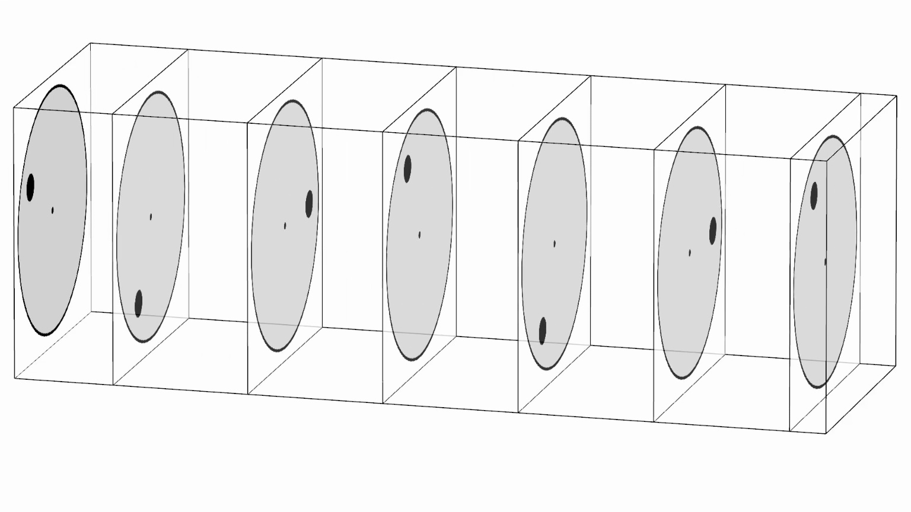
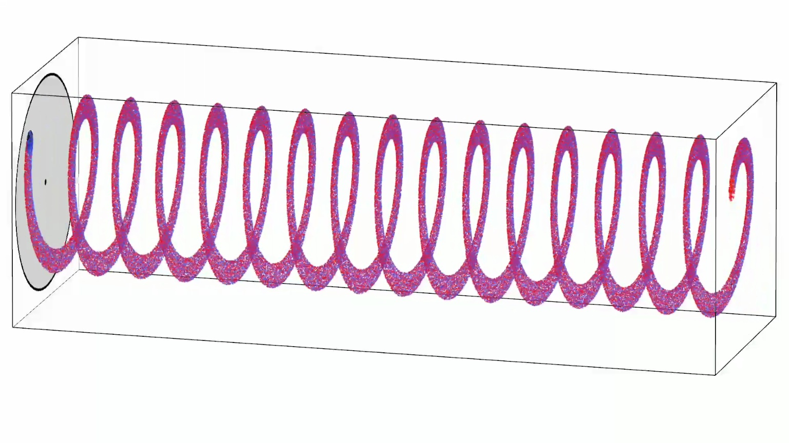
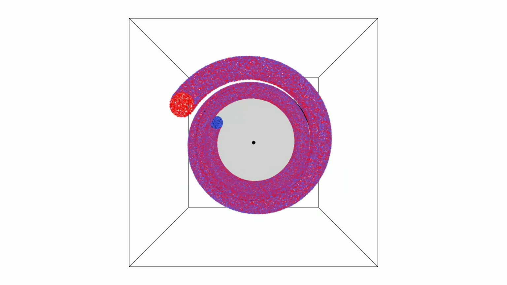
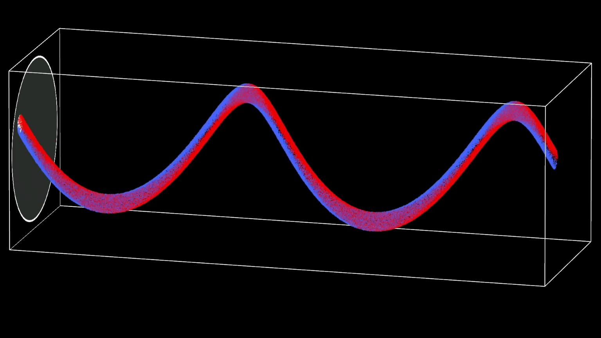

# Event Camera Explanation Video

This repository provides a simple script to generate a video to explain how the event camera works. You can use the generated video in your presentations to introduce the basic concepts of event camera. This video is inspired by the presentation by [Mueggler et al. (IROS 2014)](https://www.youtube.com/watch?v=LauQ6LWTkxM&t=38s).


You can use the generated video for your presentation to introduce basic concepts of event camera.

## Requirements

- NumPy
- OpenCV
- tqdm
- PyVista

## Gallary

### Event only

```bash
python gen_video.py 
```

[[Download video]](videos/event.mp4)


### Frame only

```bash
python gen_video.py --hide_event --show_frame
```

[[Download video]](videos/frame.mp4)


### Event only, fast rotation, don't stop rotation

```bash
python gen_video.py --speed 8 --rotation_duration 8 --rotation_speed 8 --stop_duration 0 
```

[[Download video]](videos/event_fast.mp4)


### Frame only, fast rotation, don't stop rotation

```bash
python gen_video.py --average_frames 8 --speed 8 --rotation_duration 8 --rotation_speed 8 --stop_duration 0 --hide_event --show_frame --frame_interval 120
```

[[Download video]](videos/frame_fast.mp4)


### Event + Frame

```bash
python gen_video.py --show_frame
```

[[Download video]](videos/event_frame.mp4)


### Event only, camera1

```bash
python gen_video.py --camera 1
```

[[Download video]](videos/event_camera1.mp4)


### Event only, camera2

```bash
python gen_video.py --camera 2
```

[[Download video]](videos/event_camera2.mp4)


### Event only, dark theme

```bash
python gen_video.py --dark
```

[[Download video]](videos/event_dark.mp4)


Frame only, dark theme.

```bash
python gen_video.py --hide_event --show_frame --dark
```

[[Download video]](videos/frame_dark.mp4)


### Scene Video

| Default | Fast | Dark |
|---|---|---|
| [[Download video]](videos/event_src.mp4) | [[Download video]](videos/evene_fast_src.mp4) | [[Download video]](videos/scene_dark_src.mp4) |
|  |  |  |
